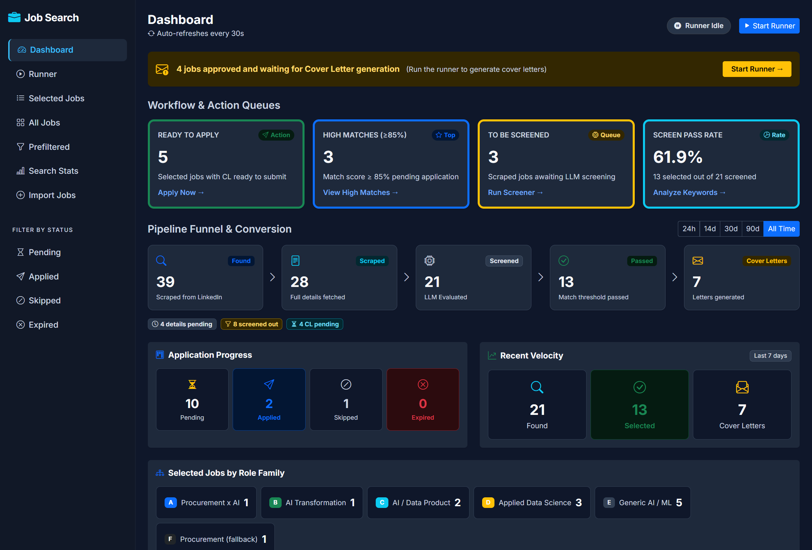
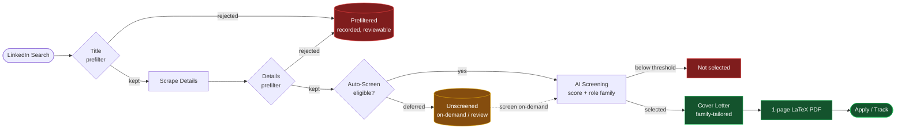
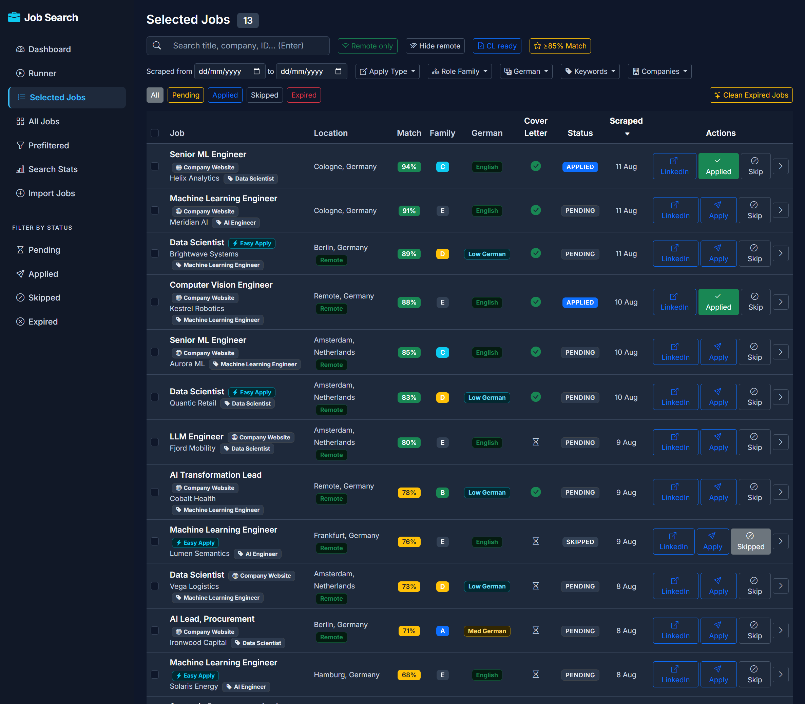
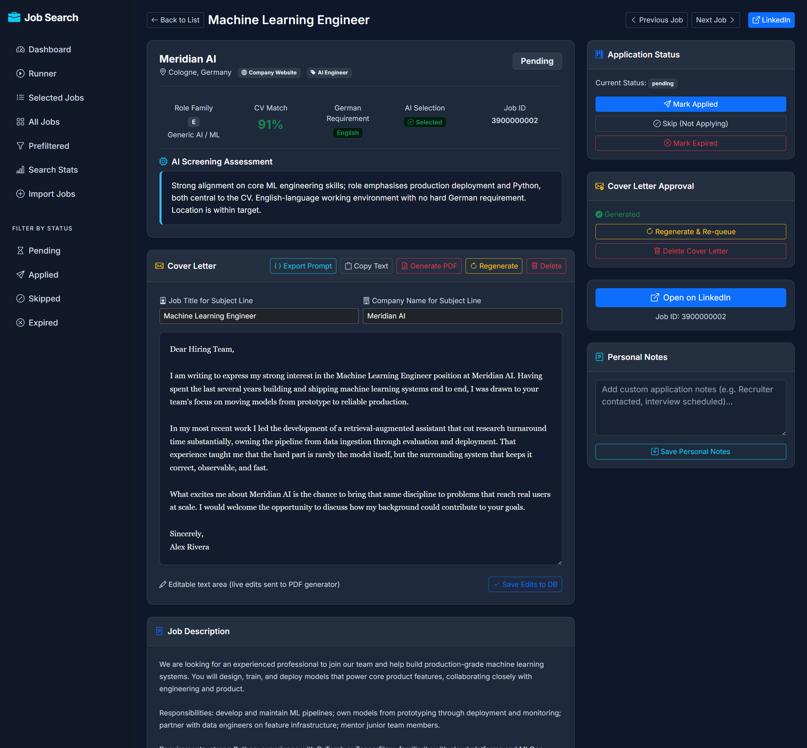
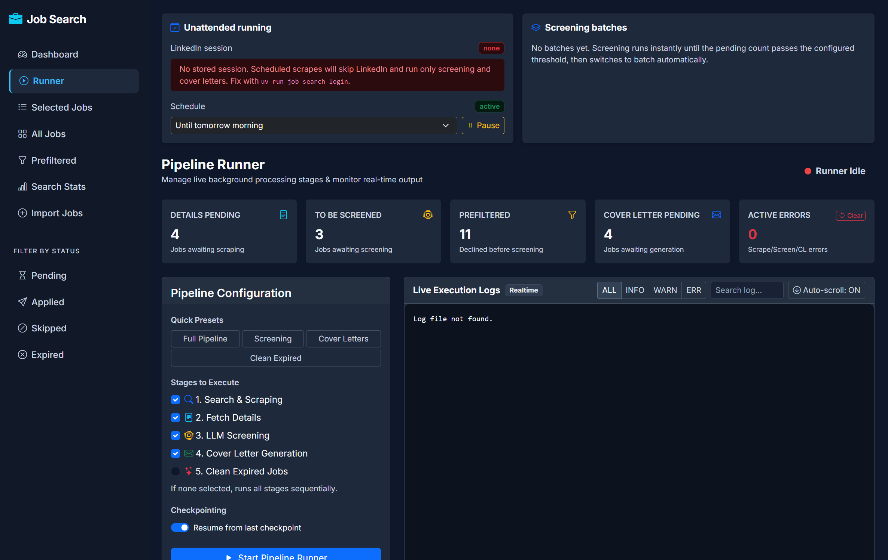
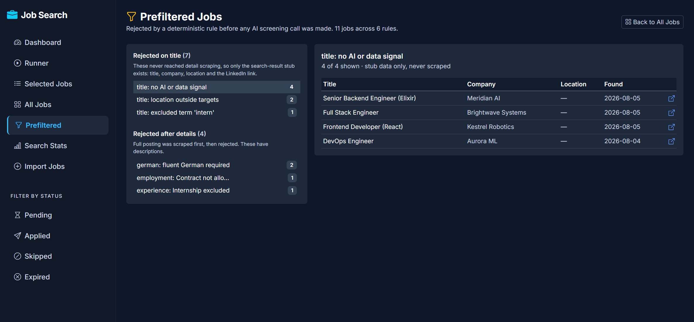
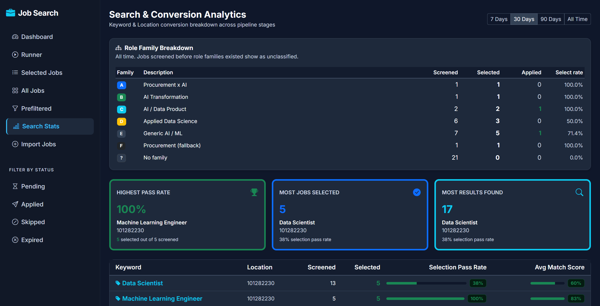

# AI-Assisted Job Search Tool


Automates LinkedIn job discovery, deterministic prefiltering, AI screening against your CV, role-family classification, tailored cover letter generation, 1-page LaTeX PDF exports, job expiration cleaning, unattended scheduling, and application tracking — all from your local machine.



> The dashboard: pipeline funnel, action queues, application progress, and a role-family breakdown. *(Screenshots use a synthetic demo dataset — no real companies or personal data.)*

---

## Features

- **Automated Job Scraping** — LinkedIn search + full details extraction with pagination (up to 500 results per keyword/location) using Selenium, with a **persisted session** so 2FA is only needed once (`uv run job-search login`).
- **Tiered Search Terms** — Each search term carries a `tier` (1 = every cycle, 2 = every other cycle, 3 = every third) and an optional per-term `max_pages`, so high-value queries are polled deeply and often while broad ones are polled sparingly.
- **Deterministic Prefilter** — Two cost-free filter stages reject obviously-unfit jobs *before* spending an AI call, recording *why* each was rejected instead of deleting it:
  - **Title stage** runs on the search stub and skips both the detail fetch and screening (e.g. non-AI/non-data titles, wrong locations).
  - **Details stage** runs after the detail fetch and skips screening for non-negotiable criteria (e.g., German-fluency requirements). Employment type and experience level prefilters are disabled by default because LinkedIn metadata frequently mislabels roles; these are evaluated accurately by the AI screener instead.
  - Rejections are reversible (clear the `prefilter_reason` column) and fully reviewable in the Web UI.
- **Selective Automated Screening & Deferral** — An `auto_screen` configuration gate lets you selectively defer AI screening based on company size (`min_company_size: "mid"`, e.g. 201+ employees) or ad language (`exclude_fully_german: true`). This conserves Gemini API budget and time while still collecting full posting details into the database. Deferred jobs are held in the **Unscreened** queue and can be screened on-demand individually or in batches via the Web UI.
- **Ad Language Detection & Badging** — Job descriptions are analyzed with a lightweight German stopword ratio detector (`detected_language`: `de` vs `en`). Postings are labeled with German or English ad badges (showing the exact stopword ratio on hover) across the Web UI and can be filtered directly in job listings.
- **Gemini AI Screening** — Scores jobs against your CV, filters out jobs requiring high German proficiency or wrong locations, and assigns a **role-family archetype (A–F)**. Fast parallel screening via the Gemini API with multi-key rotation and exponential backoff retries. Responses use **structured output** (`response_schema`), so valid JSON is the API's guarantee rather than something a regex has to recover from prose. Verdicts are made **reproducible** by pinning a sampling `seed` and dropping temperature to 0 — identical reposts were previously scoring differently on a second pass 43% of the time, flipping the selection decision outright in 6.4% of cases.
- **Batch Screening (50% cheaper)** — Screening can be submitted to the Gemini **Batch API** and collected later (up to 24h latency). An in-flight guard (`jobs.batch_job_id`) prevents paying twice or overwriting a fresh answer with a stale one, each response is claimed atomically so two collectors can never write the same row, and a machine-wide lock keeps the hourly collect task, a run's startup, and the Web UI button from colliding. `auto` mode keeps small manual runs instant and sends large or scheduled backlogs to batch.
- **Role-Family-Tailored Cover Letters** — Cover letter prompts are split into a shared instruction set plus one guidance block per family; only the block for the job's own family is sent. An optional **career-narrative layer** (`config/narrative.yaml`) supplies the reasoning, obstacles, and outcomes behind your CV lines so letters can stop restating the CV.
- **On-Demand Recruiter Messages** — A button on the job page drafts a LinkedIn outreach message and returns it in the same request, because a message you want *now* is worth nothing an hour later — this is the one AI path in the tool that does not hand work to a background worker. Two forms share one instruction set so the voice cannot drift between them: a **connection note**, held under LinkedIn's hard 300-character ceiling, and an **InMail** of a few short paragraphs. The draft is editable, saved against the job, and one click from the clipboard. An overlong note is rejected rather than trimmed — LinkedIn would refuse to send it anyway, and a request clipped mid-word is worse than pressing the button again.
- **1-Page LaTeX Cover Letter PDF Exporter** — Automated 1-page LaTeX cover letter compiler using local MiKTeX (`xelatex` / `pdflatex`). Features a centered executive header, tagline, transparent signature image, dynamic "a/an" article selection, name-derived sign-off matching, balanced bottom margin and vertical spacing, and an auto-fitting font-size algorithm with length-based vertical centering to guarantee single-page output.
- **Job Expiration Cleaner** — Detects expired or closed LinkedIn postings using the authenticated session with request pacing and rate-limit backoff (`uv run job-search clean`).
- **Cross-Process Run Control & Backlog Tracking** — A runner lock (ignores dead PIDs and stale holders), a stop file for graceful cross-process shutdown, and a schedule pause with lazy auto-resume let the Web UI, CLI, and scheduled tasks coordinate one run at a time. Active backlog action items (`screen_pending_auto`, pending details, pending cover letters) are tracked separately from cumulative deferred and prefiltered totals.
- **Unattended Scheduling** — `scripts/install_tasks.ps1` registers Windows Task Scheduler entries. The daily work has **two triggers** — 07:00 and 5 minutes after logon — because `StartWhenAvailable` did not reliably recover the morning run on a laptop that is asleep at 07:00; a `--once-daily` marker makes whichever fires second a no-op. Scheduled runs skip LinkedIn stages if the session is dead rather than opening a browser.
- **Concurrent Pipeline** — Parallel search, details, screening, and cover letter workers with graceful shutdown, checkpointing, resume, and errored-job retry.
- **Company Size From the Declared Band** — LinkedIn reports two different numbers and they disagree badly: `staffCount` is how many members list a company as their employer, while `staffCountRange` is the band the company declares. gategroup declares **10,001+** and has **2,457** members; SAP's member count *exceeds* its real headcount. Both are stored and shown, the size filter buckets on the band across seven distinct ranges (including dedicated **Startup (11–50)** and **Scale-up (51–200)** splits), and every bucket boundary sits on one of LinkedIn's nine band edges so a bucket never splits one.
- **Resilient SQLite Concurrency & Snapshots** — Database operates in WAL mode with a 30-second `busy_timeout`, `synchronous=NORMAL`, explicit WAL checkpoints on close, and optimized partial indexes (`idx_jobs_unscreened`, `idx_cover_letters_job_status`). Verified `VACUUM INTO` snapshots are taken at run boundaries and after Web UI edits, protected by quick-check integrity verification on every open and before every restore (`job-search restore latest`).
- **Application Tracking** — Mark jobs as `applied`, `interviewing`, `offered`, `rejected`, or `clear`.
- **Web UI Dashboard** — Local Flask web application (`http://127.0.0.1:5000/`) to review jobs, inspect prefiltered rejections, manage the unscreened queue, edit Job Title / Company Name / Cover Letter text live, export the exact per-job prompt, generate 1-page PDFs instantly, drive the runner and batch collection, import jobs, and track status.

---

## How It Works

Every job flows through a funnel that spends the expensive AI calls only on candidates that survive the cheap, deterministic checks first.



- **Screening** runs against the **Gemini API** and can be sent **instantly** or to the **Batch API** (≈50% cheaper) depending on whether anyone is waiting on the result. Un-prefiltered jobs can be screened automatically or deferred to an **Unscreened** queue based on company size and ad language criteria.
- **Prefiltered** and **not selected** jobs are never deleted — they are recorded with a reason so a bad rule can be spotted and reversed.

---

## Project Status

| Phase | Status | Description |
|-------|--------|-------------|
| Phase 0: Data Discovery | Complete | Scraped & cataloged LinkedIn API fields into SQLite tables |
| Phase 0.5: Cleanup & Organization | Complete | Established modular architecture & dependency management |
| Phase 1: Project Setup | Complete | Pydantic config schemas, logging, and environment settings |
| Phase 2: Database & Core | Complete | SQLite thread-safe DatabaseManager with WAL mode (migrations to v10) |
| Phase 3: Scraping Refactor | Complete | Selenium LinkedIn worker with persisted session |
| Phase 4: AI Screening | Complete | Prefilter + Gemini screener, batch API, role-family archetypes |
| Phase 5: Cover Letter Generation | Complete | Family-tailored generator with career-narrative layer |
| Phase 6: Orchestration | Complete | Parallel coordinator with resume, stage scoping, and cross-process run control |
| Phase 7: Web UI & LaTeX PDF Export | Complete | Flask dashboard, runner panel, MS Word formatting, 1-page LaTeX PDF |
| Phase 8: Scheduling | Complete | Windows Task Scheduler integration, session persistence, schedule pause |

---

## Setup

### 1. Install dependencies

```bash
uv lock
uv sync
```

### 2. Configure credentials

```bash
cp config/.env.example config/.env
```

Edit `config/.env`:

```env
LINKEDIN_USERNAME=your_email@example.com
LINKEDIN_PASSWORD=your_password
GEMINI_API_KEY_1=your_primary_key_here
GEMINI_API_KEY_2=          # optional API key for rotation
GEMINI_API_KEY_3=          # optional API key for rotation
```

### 3. Configure search, CV, prompts, and narrative

```bash
cp config/config.yaml.example   config/config.yaml
cp config/filters.yaml.example  config/filters.yaml
cp config/cv.yaml.example       config/cv.yaml
cp config/prompts.yaml.example  config/prompts.yaml
cp config/narrative.yaml.example config/narrative.yaml   # optional
```

- **`config/config.yaml`** — search terms (with tiers/max_pages), screening thresholds and mode, schedule/auth settings, and export directories (`export.output_dir`, `export.pdf_dir`).
- **`config/filters.yaml`** — the long lists: `title_filter` keyword rules and `blocked_companies`. Referenced from `config.yaml` via `search.filters_file` and merged at load time, with anything set inline in `config.yaml` winning. Keeping them out of the main file stops a 300-entry list from being silently misindented under the wrong section.
- **`config/cv.yaml`** — your real CV data, including a `projects` block (used by both the screener and the cover letter generator).
- **`config/prompts.yaml`** — AI screening and cover letter prompt templates.
- **`config/narrative.yaml`** *(optional)* — proof-point stories tagged by role family. Without it, cover letter prompts gracefully degrade to CV facts.

> `config.yaml`, `filters.yaml`, `cv.yaml`, `prompts.yaml`, and `narrative.yaml` are all gitignored and never committed. Only their `.example` counterparts are tracked.

### 4. Choose a screening mode

Set these under `screening:` in `config/config.yaml`:

| Setting | Values | Notes |
|---------|--------|-------|
| `mode` | `"instant"` \| `"batch"` \| `"auto"` | `auto`: scheduled runs batch (50% cheaper), manual runs stay instant unless the backlog exceeds `batch_threshold` |
| `batch_threshold` | integer | Manual-run-only override; a backlog this large is sent to batch |
| `batch_stale_after_hours` | float | Warn about a batch left open longer than this |

---

## Running the Tool

### Sign in once (required before the first run)

```bash
uv run job-search login
```

Opens a browser to sign in to LinkedIn (approve 2FA on your phone if prompted) and stores the session. Scheduled and later runs reuse it until LinkedIn invalidates it. Use `--force` to re-authenticate.

### Run the full pipeline

```bash
uv run job-search run
```

Executes the full pipeline: search → prefilter → scrape details → screen jobs → generate cover letters. Uses the stored session; only falls back to an interactive login if the session is dead.

### Resume, stage selection, and unattended runs

```bash
# Resume from the last checkpoint (default)
uv run job-search run --resume

# Run only specific stages
uv run job-search run -s screen                   # screen pending jobs only
uv run job-search run -s cover-letter             # generate cover letters only
uv run job-search run -s screen -s cover-letter
uv run job-search run -s search -s details        # scrape only (no AI)

# Unattended: never open a browser; drop LinkedIn stages if the session is dead
uv run job-search run --no-interactive
uv run job-search run --scheduled                 # implies --no-interactive, honours schedule pause
uv run job-search run --max-runtime 4             # bound this run to 4 hours
```

### Inspect and control unattended running

```bash
uv run job-search status        # LinkedIn session, runner lock, and schedule-pause state
uv run job-search stop          # ask the running pipeline (any process) to stop gracefully
uv run job-search pause         # suppress scheduled runs (default: until tomorrow morning)
uv run job-search pause 12h     # 12h | tomorrow_morning | 24h | indefinite
uv run job-search resume        # resume scheduled runs immediately
```

### Clean expired postings, reset errors, purge blocked companies

```bash
uv run job-search clean                    # detect closed postings, mark them expired
uv run job-search clean --limit 50
uv run job-search clean                    # on demand: no time bound, runs until the backlog is done
uv run job-search clean --max-runtime 5    # stop between batches after 5h, releasing the lock cleanly

uv run job-search reset-errors             # reset all error types for retry
uv run job-search reset-errors --stage details
uv run job-search reset-errors --stage screening

uv run job-search purge-blocked --dry-run  # preview jobs from blocked companies
uv run job-search purge-blocked            # remove them
```

### Batch screening by hand

```bash
uv run job-search batch submit             # send everything pending and exit; does not wait
uv run job-search batch submit --limit 200
uv run job-search batch collect            # poll open batches, write back whatever has finished
uv run job-search batch list               # recent batches and their state
```

Only one collector runs at a time machine-wide (`data/collect.lock`), so this command, the hourly collect task, a run's startup, and the Web UI button can never overlap — whoever arrives second steps aside rather than re-polling the same batch. Results land in the same database either way.

### Company size backfill

```bash
uv run job-search backfill-sizes --dry-run     # how much is outstanding, largest companies first
uv run job-search backfill-sizes               # fetch the declared size band for older jobs
uv run job-search backfill-sizes --limit 200 --max-runtime 2
```

Company size lives on every job row, so repairing rows scraped before the band was captured could mean one request per *job*. This walks distinct **companies** instead — one request fills in every job row that company owns — and is safe to interrupt: a company already written is skipped next time, so re-running continues where it stopped.

### Database snapshots & recovery

```bash
uv run job-search backup                   # verified snapshot, ~1s
uv run job-search backup --list            # existing snapshots with age and size
uv run job-search backup --offsite         # also write the compressed copy offsite
uv run job-search restore latest           # verify, swap in, keep the current file
uv run job-search restore jobs-20260820-135725-run.db
```

Snapshots use SQLite's `VACUUM INTO`, which writes a transactionally consistent image in well under a second. That is the point: a byte-level copy of a live database — a sync client, a drag in Explorer, `shutil.copy` — reads `jobs.db`, `-wal` and `-shm` at different moments while they are being written, and can produce a file that looks fine and is not.

Every snapshot is verified with `quick_check` before it is kept, and again before a restore. **An unverified backup is not a backup** — it is possible to hold five copies of a database and have three of them be the same corruption. Because each retained snapshot is verified, three of them are worth more than five unchecked ones, and the count stops being the safety margin; what it buys is reach, which is why `tier_hours` spreads the three slots over newest / ~12h / ~1 week rather than over the last twenty minutes.

They are taken automatically:

| trigger | why |
|---------|-----|
| End of each pipeline run | after the work, not before — a pre-run snapshot is a state already on disk |
| Once you stop editing in the Web UI | applying, skipping, approving and note-taking happen there, and no run can reproduce them |
| Web UI startup, if the database changed since the last snapshot | closes the gap left by a session that ended before its edits were captured |
| Before `purge-blocked`, `clean`, `backfill-sizes` | the operations worth being able to undo |
| Never on reads, and never at process exit | nothing new to capture; and a shutdown has no time to spend |

**Never at exit, deliberately.** A `VACUUM INTO` of a 265 MB database takes 6–11 seconds. Doing that from an `atexit` hook meant an IDE's stop button killed the process mid-write — exit code `-1`, no snapshot, and a quarter-gigabyte `.partial` left behind. Nothing was ever at risk (SQLite commits a UI edit when the request returns, and a snapshot copies the whole database anyway), so coverage is closed at *startup* instead, where there is no deadline to miss. `min_interval_seconds` also floors how often the Web UI may snapshot: without it, every natural pause in an editing session triggered a full VACUUM — eleven of them in one hour of browsing.

Opening the database also runs `quick_check` first (`database.check_integrity_on_open`). Opening runs migrations, so **every open is a write**: without the check, a damaged file quietly accumulates more damage every time anything touches it. On failure nothing is written and the error names the recovery command.

Set `backup.offsite_path` to a path inside a synced folder (Drive, Dropbox, …) to get a compressed copy under a *stable* filename — the sync provider's own version history then becomes the offsite tier. Syncing a snapshot is safe; syncing the live database is what corrupts it.

### Terminal listing & application tracking

```bash
uv run job-search list
uv run job-search list --status pending

uv run job-search track <job_id> applied
uv run job-search track <job_id> interviewing
uv run job-search track <job_id> offered
uv run job-search track <job_id> rejected
uv run job-search track <job_id> clear
```

### Export cover letters & CSV index

```bash
uv run job-search export
uv run job-search export --output-dir data/export
```

---

## Scheduling (Windows)

Register the scheduled Task Scheduler entries:

```powershell
powershell -ExecutionPolicy Bypass -File scripts/install_tasks.ps1
```

| Task | Trigger | What it runs |
|------|---------|--------------|
| `JobSearch-Daily` | Daily 07:00 | Scrape (1h), then **scrape-details-then-screen** + cover letters (2h) |
| `JobSearch-Catchup` | 5 min after logon | The same daily work, skipped if 07:00 already did it |
| `JobSearch-Collect` | Twice daily (08:00, 20:00) | `batch collect` — writes back finished screening batches |
| `JobSearch-Clean` | Weekly, Sunday 03:00 | Expiry sweep, bounded by `cleaner.scheduled_max_runtime_hours` (2h) |

**Two triggers for one job, because a laptop is not a server.** The 07:00 trigger is missed whenever the machine is asleep, and `StartWhenAvailable` did not reliably recover it — scraping silently stopped happening for days. The logon trigger closes that gap. Both legs carry `--once-daily`, so whichever fires first does the work and the other exits immediately; if scraping succeeded but screening died, the catch-up re-runs only the screening. State lives in `data/last_run.json`, keyed by leg and compared on the calendar date.

Scrape and screen run **in sequence within one task** rather than as two tasks 15 minutes apart. The old gap assumed scraping always finished inside its hour; twice it did not, and screening exited with *"another run is already in progress"* instead of running.

**The screening leg scrapes details before it screens.** Search fills the details queue faster than the detail workers drain it and never stops refilling, so the scrape leg's hour always ended with a backlog — and screening is fed by the details stage rather than by a database poll, so it then ran over whatever happened to be finished and left the rest for the next day, while the next morning piled more on top. The screening leg now carries `-s details` and runs no search worker, so its queue is finite and drains, and the batch it submits covers the day's whole intake. A run also **flushes a final batch on the way out**, ignoring `batch_threshold`: mid-run, waiting for a full batch is what makes batches cheap, but at the end there is no later batch to wait for. A `-s screen` run without `-s details` now says so in the log instead of looking like "nothing to do".

**Only scheduled sweeps get a time bound.** `cleaner.scheduled_max_runtime_hours` (2h) applies under `--scheduled`, where the sweep shares the machine with the daily legs. An on-demand sweep — the CLI, or the Web UI's Clean Expired button — runs to completion: nothing is queued behind it, and stopping half way only means re-checking the same postings next time. A long run now **refreshes its lock**, so staleness means "no sign of life" rather than "started a while ago"; previously any run outliving `lock_stale_after_minutes` silently stopped being protected, and the next scheduled task started alongside it.

The tasks run `scripts/scheduled_run.bat`, pass `--scheduled`, and use `StartWhenAvailable` so a run missed while the laptop slept fires on wake — note that this means several missed tasks can fire together the moment the machine comes back. Re-running `install_tasks.ps1` clears every `JobSearch-*` task before registering, so a renamed or dropped task cannot be left firing on its old schedule. Pause or resume the whole schedule at any time with `job-search pause` / `job-search resume`, or from the Web UI runner panel.

---

## Web UI Dashboard

Start the Flask dashboard (it also auto-starts with the pipeline):

```bash
uv run job-search web
```

Open `http://127.0.0.1:5000/` in your browser.

| Dashboard Page | Capabilities |
|----------------|--------------|
| **Dashboard** | Overview metrics, active backlog queue counters (pending details, pending auto-screen, pending cover letters), cumulative stats, application-stage breakdowns, and role-family summary |
| **Selected Jobs** | AI-matched jobs with match scores, German flags / ad language badges, role-family badges, Easy-Apply vs Company-Website tags, Scrape Date ("Month Day, Year"), declared size band + LinkedIn member count, industry, language filter (`lang=de` / `lang=en`), a **multi-select company-size** filter over seven buckets (micro / startup / scaleup / mid / large / enterprise / global) with one-click "& above", and quick actions |
| **All Jobs** | Master repository of all scraped jobs, with company inclusion/exclusion, company-size filtering, language filtering, AI selection filter (`sel=0` Not Selected, `sel=1` Selected, All), and screened/unscreened toggle |
| **Unscreened Jobs** | Dedicated review queue for jobs deferred by auto-screen criteria (e.g. small company size, German ad), displaying deferral reasons, language badges, scrape dates, with batch screening and individual screen-now actions |
| **Prefiltered** | Deterministic rejections grouped by rule and stage, so an over-aggressive rule can be spotted and reversed |
| **Search Stats** | Conversion-funnel metrics per keyword/location, with a role-family breakdown |
| **Runner** | Session health, active backlog vs cumulative stats, schedule pause/resume, stop & force-stop for a run owned by any process, batch collection with per-batch abandon, start-run, clear-errors, and live logs |
| **Import Jobs** | Add jobs manually by URL |
| **Job Detail** | Live-editable **Job Title**, **Company Name**, and **Cover Letter Text**; Scrape Date; MS Word clipboard formatter; **Export Prompt** (exact system + user prompt for that job); Delete/Regenerate cover letter; instant **1-Page "Generate PDF"** compiler; on-demand **Recruiter Message** in either LinkedIn form |

### Screenshots

**Selected Jobs** — match score, role-family badge, German level, cover-letter status, Easy-Apply vs Company-Website tags, and one-click apply/skip:



**Job Detail** — AI screening assessment, editable cover letter wired live to the PDF generator, application status, and prompt export:



<table>
  <tr>
    <td width="50%"><br/><sub><b>Runner</b> — session health, schedule pause, batch collection, stage selection, and live logs.</sub></td>
    <td width="50%"><br/><sub><b>Prefiltered</b> — deterministic rejections grouped by rule and stage, with the exact postings each rule caught.</sub></td>
  </tr>
  <tr>
    <td width="50%"><br/><sub><b>Search Stats</b> — per-keyword conversion funnel and role-family breakdown.</sub></td>
    <td width="50%" valign="top"><br/><sub>All screenshots are rendered from a <b>synthetic demo dataset</b> — the company names, job titles, and candidate identity shown are invented for illustration.</sub></td>
  </tr>
</table>

---

## Cover Letter PDF & Export Formats

### 1-Page LaTeX PDF Cover Letters
When clicking **"Generate PDF"** on the Web UI or calling the exporter:
- PDF is compiled using your local MiKTeX installation (`xelatex` / `pdflatex`).
- Saved to `export.pdf_dir` (e.g. `Applicant_Name_CoverLetter_[Company].pdf`).
- Features a centered executive header and tagline, transparent signature image, dynamic "a/an" article selection (`an AI Engineer` vs `a Data Scientist`), name-derived sign-off matching, length-based vertical centering, and an auto-fitting font-size algorithm that guarantees a single page.

### Text & CSV Exports
- **Text Files**: Written to `export.output_dir` (e.g. `Company_Title_JobId.txt`) with metadata, match score, notes, and cover letter.
- **`index.csv`**: Master summary CSV listing all selected jobs, URLs, and application statuses.

---

## Running Tests

```bash
uv run pytest tests/ -v
```

504 automated unit tests covering:
- Database CRUD, WAL-mode transaction safety, busy timeout, and schema migrations
- Pydantic configuration schemas and `.env` credentials loading
- Deterministic prefilter rules (title and details stages)
- Selective automated screening deferral criteria (company size thresholds, German ad exclusion)
- Ad language detection and German stopword ratio analysis
- Role-family archetype validation
- Gemini API key rotation and exponential backoff
- Batch screening submission, collection, and in-flight guarding
- Verified snapshots, retention tiers, restore, and the corruption tripwire
- Company size bands, bucket boundaries (including startup/scaleup split), and the per-company backfill
- Cookie jars holding duplicate names (LinkedIn sets JSESSIONID twice)
- Screening-response parsing: fences, nested objects, a missing opening brace
- Snapshot staleness at startup, the interval floor, and abandoned .partial sweeps
- The once-daily guard behind the 07:00 / logon catch-up pair
- Screening-mode routing (instant / batch / auto by origin)
- Tiered search-term scheduling
- Cross-process run control (locks, stop file, schedule pause)
- Prompt template manager and markdown formatting
- Job cleaner & expiration detection (including query prioritization)
- Flask Web UI routes, active backlog separation, unscreened queue, MS Word line-break formatting, and live PDF endpoints
- 1-Page LaTeX PDF compiler, dynamic article logic, and sign-off spacing

---

## Project Structure

```
├── config/
│   ├── config.yaml.example          # Search terms/tiers, screening mode, schedule, export paths
│   ├── filters.yaml.example         # Title keyword rules & blocked companies — copy to filters.yaml
│   ├── cv.yaml.example              # CV template (incl. projects) — copy to cv.yaml and fill in
│   ├── prompts.yaml.example         # AI screening & cover letter prompt templates
│   ├── narrative.yaml.example       # Optional career-narrative proof points, tagged by role family
│   ├── cover_letter_template.tex    # Executive 1-page LaTeX cover letter template
│   └── .env.example                 # Credentials template — copy to .env
├── data/
│   ├── backups/                     # Verified database snapshots (gitignored)
│   ├── export/                      # Default text/CSV/PDF export directory (gitignored)
│   └── samples/                     # Discovery field catalog and SQL schemas
├── docs/
│   └── screenshots/                 # Web UI screenshots used in this README
├── scripts/
│   ├── cleanup_errors.py            # Standalone script to clear pipeline errors
│   ├── export_db.py                 # Export database tables to CSV
│   ├── fix_incomplete_cover_letters.py # Purge incomplete/truncated cover letter entries
│   ├── install_tasks.ps1            # Register Windows Task Scheduler entries
│   ├── scheduled_run.bat            # Entry point invoked by the scheduled tasks
│   ├── test_login.py                # Test LinkedIn auth & session cookie saving
│   ├── view_db.py                   # Standalone SQLite database viewer
│   └── phase0_discovery/            # One-off LinkedIn API field discovery scripts
├── src/
│   └── job_search/
│       ├── ai/                      # Gemini screener, batch screener, cover letter generator, prompt manager
│       ├── cleaner/                 # LinkedIn job expiration cleaner
│       ├── core/                    # Pydantic config, SQLite database manager, prefilter, run control,
│       │                            #   session store, verified snapshots (backup.py), pipeline state
│       ├── export/                  # Text/CSV exporter & 1-page LaTeX PDF exporter
│       ├── orchestration/           # Parallel pipeline coordinator & worker pools
│       ├── scraping/                # Selenium LinkedIn auth, search & details workers,
│       │                            #   company size backfill (company_backfill.py)
│       ├── utils/                   # Logging (loguru), Gemini API key rotation, formatting helpers
│       └── web/                     # Flask web dashboard (templates, static CSS, routes)
└── tests/                           # Unit test suite (504 tests)
```

---

## License

Licensed under the [PolyForm Noncommercial License 1.0.0](LICENSE). You are free to use, study, modify, and share this project **for any noncommercial purpose**; commercial use is not permitted. See the [LICENSE](LICENSE) file for the full terms.
